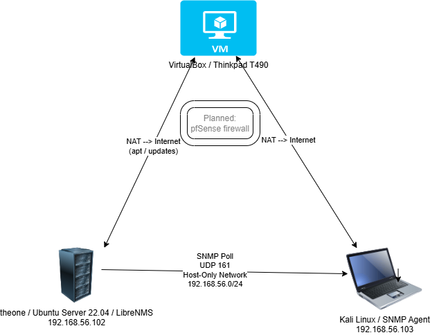
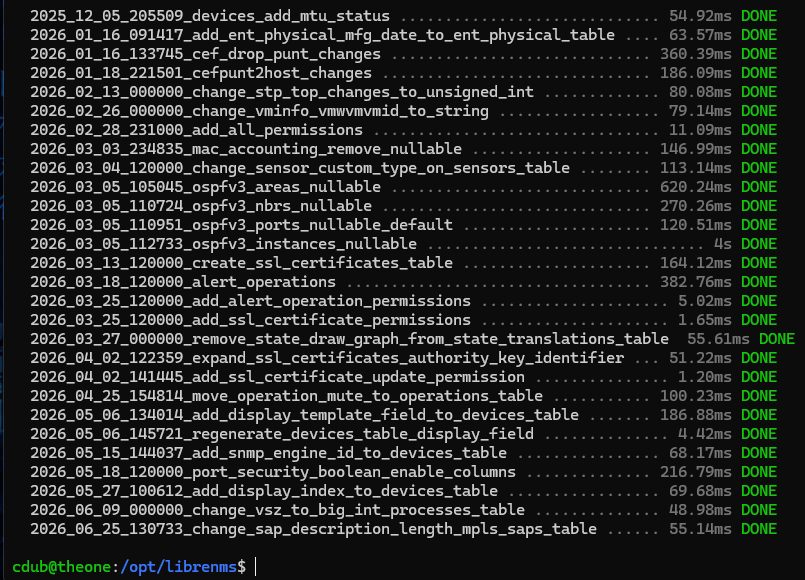
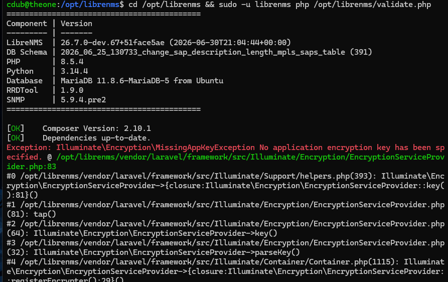
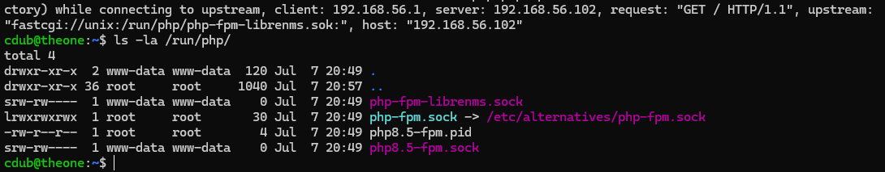
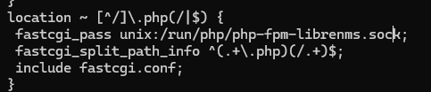
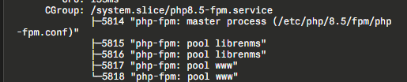
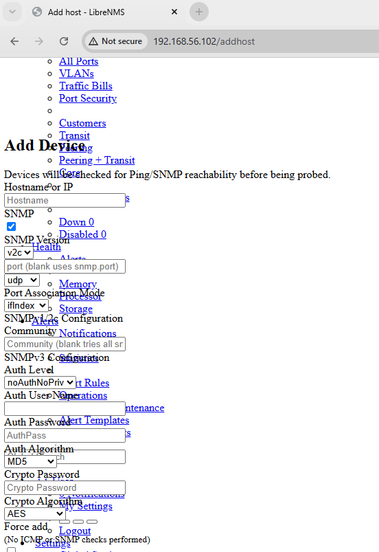
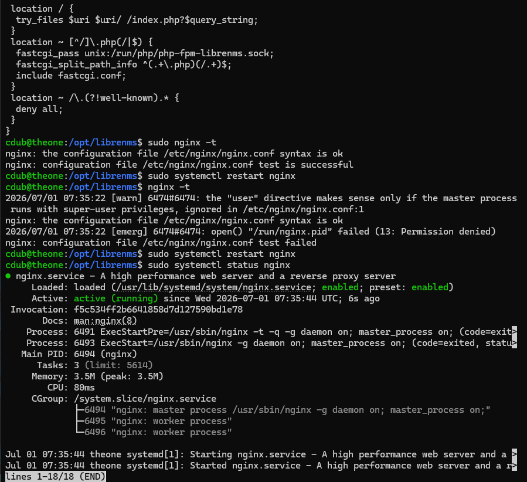
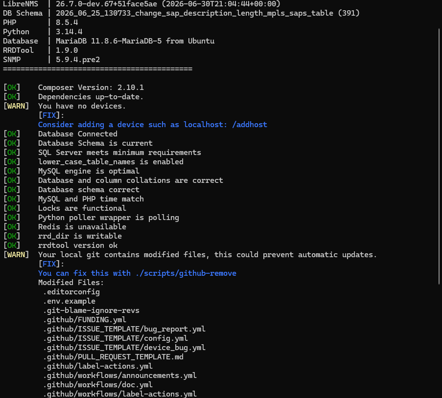
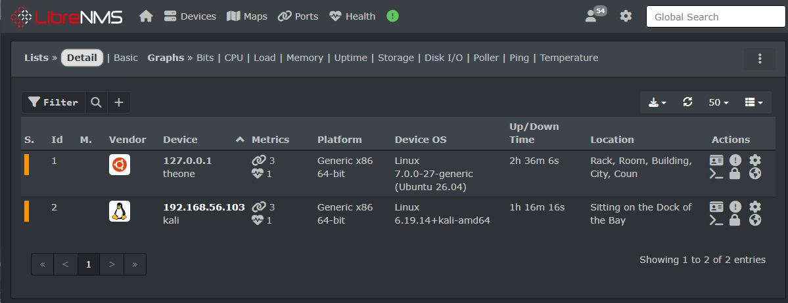

# Home Lab: Network Monitoring with LibreNMS

## Overview

Designed and deployed a network monitoring stack in a self-hosted virtual lab, built from the ground up on Ubuntu Server 22.04 LTS. The project simulates a small enterprise monitoring environment: a LibreNMS instance polling network devices via SNMP, backed by MariaDB, PHP-FPM, and Nginx.

Built as part of a structured transition into cybersecurity, alongside CompTIA Security+ (SY0-701) study and Hack The Box modules.

## Why I Built This

Monitoring and visibility are foundational to security operations — you can't defend, receive alerts, or investigate what you can't see. I wanted hands-on experience with the full stack behind a monitoring platform (not just clicking through a GUI), including the Linux service dependencies, database layer, and networking configuration that make it work — and break.

## Environment

| Component         | Details                                        |
|-------------------|------------------------------------------------|
| Host              | ThinkPad T490                                  |
| Hypervisor        | VirtualBox                                     |
| Monitoring server | Ubuntu Server 22.04 LTS                        |
| Stack             | LibreNMS, MariaDB, PHP-FPM, Nginx, SNMP        |
| Network           | Dual-adapter config (NAT + host-only/internal) |
| Monitored devices | 2 VMs (SNMP-polled)                            |

## What It Does

- Polls monitored devices over SNMP for uptime, interface stats, and health metrics
- Stores time-series and device data in MariaDB
- Serves the LibreNMS web UI through Nginx + PHP-FPM
- Provides a single dashboard for device status across the lab network

## Build Process (High-Level)

1. Provisioned Ubuntu Server 22.04 LTS as a VirtualBox VM with dual network adapters (one NAT for internet/updates, one host-only for lab device communication)
2. Installed and configured the LEMP-adjacent stack: Nginx, PHP-FPM, MariaDB
3. Installed LibreNMS and configured its dependencies (cron jobs, `lnms` validation, permissions)
4. Configured SNMP on target devices and added them to LibreNMS for polling
5. Validated data collection and dashboard rendering end-to-end

## Challenges & Troubleshooting

This is the part that mattered most — the actual learning happened in the failures.

---

**PHP package version mismatch**

Initial install command referenced `php8.1-*` packages, which weren't available in Ubuntu's default repositories, producing a wall of dependency errors.

*Fix: Ran `php --version` and `apt-cache search php | grep php8` to confirm Ubuntu already had PHP 8.5 available in its default repos — no third-party PPA required. Updated every package name in the install command from `php8.1-*` to `php8.5-*` and the install completed cleanly.*

---

**VM networking — internet access lost after adapter change**

Switching the server VM's network adapter from NAT to Host-only (required for VM-to-VM communication on the `192.168.56.x` subnet) broke outbound internet access entirely, causing `apt` package downloads to fail with connection errors.

*Fix: Added a second network adapter to the VM — Adapter 1 set to Host-only for lab network communication, Adapter 2 set to NAT for internet access. This dual-adapter approach gives the VM both isolated lab visibility and outbound connectivity. Applied the same fix to the Kali VM once it was added to the monitoring environment.*

---

**Database credentials not being read**
`Access denied for user 'librenms'@'localhost' (using password: NO)`

The `(using password: NO)` detail was the key clue — it meant no password was even being sent, pointing to a configuration problem rather than a wrong credential.

*Fix: Examined the `.env` file and found all DB credential lines commented out with `#`, so they were being treated as comments and never passed to MariaDB. Removed the `#` from each line and confirmed the connection succeeded.*

---

**Working directory / process identity mismatch**

LibreNMS error output showed its working directory as `/home/USERNAME` instead of `/opt/librenms`, and file operations were failing with `Permission denied` — a mismatch between the user context running the process and the `librenms` user that owns the application files.

*Fix — two parts:*

- Added my user to the `librenms` group (`sudo usermod -aG librenms USERNAME`) and logged out/in for the group change to take effect — restoring shell-level read/write access to the LibreNMS directory.
- That alone didn't fix the database migration step, which needed to run as the `librenms` user specifically. Resolved with `cd /opt/librenms && sudo -u librenms php artisan migrate --force` — explicitly setting the correct user and working directory in a single command. `--force` skips Laravel's interactive confirmation prompt, appropriate for a controlled lab install but worth noting as something to avoid on a production system.

*Database migrations completing cleanly after resolving the process identity mismatch*

---

**Cascading symptom: `MissingAppKeyException`**

The same root cause surfaced again as a separate-looking error — Laravel's encryption key had never been generated with the correct user context.

*Fix: `sudo -u librenms php artisan key:generate`, run explicitly as the `librenms` user so the newly written key was owned correctly. Good reminder that one misconfiguration can cascade into multiple seemingly unrelated errors depending on which part of the application hits it first.*

*The `MissingAppKeyException` — same root cause as the migration issue, different surface*

---

**PHP-FPM socket ownership mismatch — 502 Bad Gateway**

The PHP-FPM pool config has two related but distinct settings: `user`/`group` (what Linux user the PHP-FPM worker processes run as) and `listen.owner`/`listen.group` (who owns the socket file itself). Set `user`/`group` to `librenms` correctly, then also changed `listen.owner`/`listen.group` to `librenms` to "match" — which immediately broke the site with a 502.

*Fix: Checked the socket file directly with `ls -la /run/php/php-fpm-librenms.sock` to confirm its actual on-disk ownership. Nginx runs as `www-data` — once the socket's owning group no longer included `www-data`, Nginx had no path to reach it. Reverted `listen.owner`/`listen.group` back to `www-data` while keeping `user`/`group` as `librenms`. The PHP-FPM process still runs as the correct application user, but the socket remains accessible to the process connecting to it (Nginx). Two settings, two different jobs.*

*`ls -la /run/php/` confirming socket ownership — nginx error log shows the path mismatch that caused the 502*

*`systemctl status php8.5-fpm` showing both the librenms and www pools running*

*Corrected nginx config with `fastcgi_pass` pointing to the right socket path*

---

**403 Forbidden — Nginx blocked from serving assets**

Nginx could reach the application but every CSS and JS asset returned 403 Forbidden, leaving the dashboard rendering as unstyled raw HTML. Confirmed via browser dev tools (F12 → Console).

*Dashboard rendering as raw HTML before the permissions fix — all CSS and JS returning 403*

*Fix: The `/opt/librenms/html` directory had permissions too restrictive for nginx to read files from. Resolved with `sudo chmod -R 755 /opt/librenms/html`, then verified nginx config syntax with `sudo nginx -t` before restarting.*

*`sudo nginx -t` confirming config syntax is valid before restarting the service*

*Later tightened further — directories kept at `755`, regular files narrowed to `644` (no execute needed since PHP-FPM interprets `.php` files rather than executing them directly). Verified with a before/after count: 922 files initially at `755`, confirmed at `0` after re-running with `644` — narrowing the attack surface without breaking functionality.*

---

## Validation & Dashboard

After resolving all issues, `validate.php` returned a clean health check with no `[FAIL]` items:

*`sudo -u librenms php /opt/librenms/validate.php` — clean output confirming all components healthy*

The LibreNMS dashboard loaded correctly with full CSS and device data populating after the first poll cycle:

*LibreNMS web dashboard running at `http://192.168.56.102` with two devices being monitored*

---

## What I'd Add Next

-[x] Network topology diagram (draw.io / Excalidraw)
-[x] pfSense or OPNsense firewall in front of the lab segment
- Suricata or Zeek for IDS/network traffic visibility, feeding alerts into LibreNMS or a SIEM
- Attack simulation against a monitored VM — generate traffic, observe it in the dashboard
- Automate device onboarding with the LibreNMS API instead of manual entry

## Documentation

- [`docs/install-guide.md`](./docs/install-guide.md) — full step-by-step install with commands explained line by line
- [`configs/librenms-nginx.conf`](./configs/librenms-nginx.conf) — sanitized Nginx server block
- [`configs/librenms-fpm-pool.conf`](./configs/librenms-fpm-pool.conf) — sanitized PHP-FPM pool config
- [`screenshots/`](./screenshots/) — terminal output and dashboard screenshots from the build

---

*Part of an ongoing home lab built while studying for CompTIA Security+ (SY0-701).*
